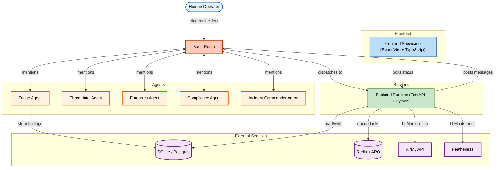

# Architecture Flow — System Context

```mermaid
graph TB

    HumanOp(["Human Operator"])

    subgraph FrontendG["Frontend"]
        FrontendApp["Frontend Showcase (React/Vite + TypeScript)"]
    end

    subgraph BackendG["Backend"]
        BackendRun["Backend Runtime (FastAPI + Python)"]
    end

    BandRoom["Band Room"]

    subgraph AgentsG["Agents"]
        TriageAg["Triage Agent"]
        ThreatAg["Threat Intel Agent"]
        ForenAg["Forensics Agent"]
        ComplAg["Compliance Agent"]
        CommdrAg["Incident Commander Agent"]
    end

    subgraph ExternalG["External Services"]
        DBStore[("SQLite / Postgres")]
        RedisQueue[("Redis + ARQ")]
        AIMLAPI["AI/ML API"]
        Featherless["Featherless"]
    end

    HumanOp -->|triggers incident| BandRoom
    BandRoom -->|dispatches to| BackendRun
    BackendRun -->|posts messages| BandRoom
    BandRoom <-->|mentions| TriageAg
    BandRoom <-->|mentions| ThreatAg
    BandRoom <-->|mentions| ForenAg
    BandRoom <-->|mentions| ComplAg
    BandRoom <-->|mentions| CommdrAg
    FrontendApp -->|polls status| BackendRun
    TriageAg -->|store findings| DBStore
    BackendRun -->|queue tasks| RedisQueue
    BackendRun -->|read/write| DBStore
    BackendRun -->|LLM inference| AIMLAPI
    BackendRun -->|LLM inference| Featherless

    style HumanOp fill:#e3f2fd,stroke:#1565c0,stroke-width:2px,color:#000000
    style FrontendApp fill:#bbdefb,stroke:#0d47a1,stroke-width:2px,color:#000000
    style BackendRun fill:#c8e6c9,stroke:#1b5e20,stroke-width:2px,color:#000000
    style BandRoom fill:#ffccbc,stroke:#bf360c,stroke-width:3px,color:#000000
    style TriageAg fill:#fff3e0,stroke:#e65100,stroke-width:2px,color:#000000
    style ThreatAg fill:#fff3e0,stroke:#e65100,stroke-width:2px,color:#000000
    style ForenAg fill:#fff3e0,stroke:#e65100,stroke-width:2px,color:#000000
    style ComplAg fill:#fff3e0,stroke:#e65100,stroke-width:2px,color:#000000
    style CommdrAg fill:#fff3e0,stroke:#e65100,stroke-width:2px,color:#000000
    style DBStore fill:#f3e5f5,stroke:#6a1b9a,stroke-width:2px,color:#000000
    style RedisQueue fill:#f3e5f5,stroke:#6a1b9a,stroke-width:2px,color:#000000
    style AIMLAPI fill:#f3e5f5,stroke:#6a1b9a,stroke-width:2px,color:#000000
    style Featherless fill:#f3e5f5,stroke:#6a1b9a,stroke-width:2px,color:#000000
```
