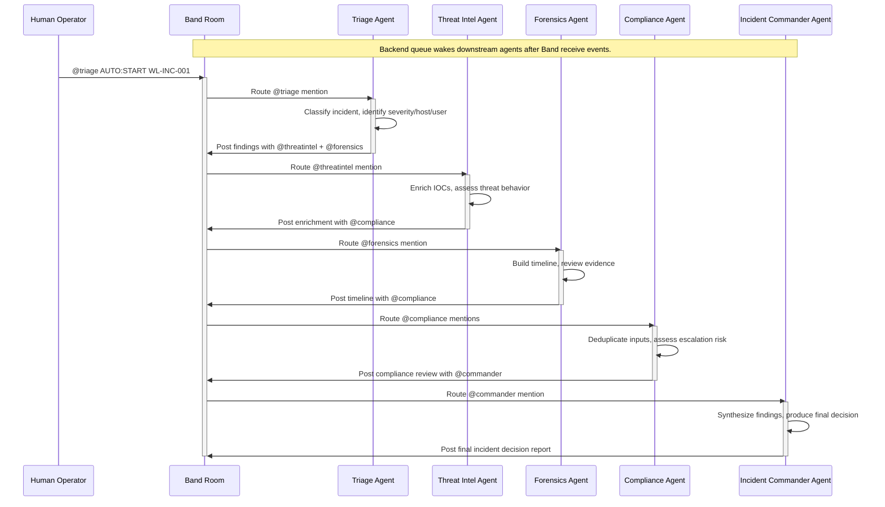

# Incident Sequence — WL-INC-001

```mermaid
sequenceDiagram
    participant Human as Human Operator
    participant Band as Band Room
    participant Triage as Triage Agent
    participant ThreatIntel as Threat Intel Agent
    participant Forensics as Forensics Agent
    participant Compliance as Compliance Agent
    participant Commander as Incident Commander Agent

    Note over Band,Commander: Backend queue wakes downstream agents after Band receive events.

    Human->>Band: @triage AUTO:START WL-INC-001
    activate Band
    Band->>Triage: Route @triage mention
    activate Triage
    Triage->>Triage: Classify incident, identify severity/host/user
    Triage->>Band: Post findings with @threatintel + @forensics
    deactivate Triage
    Band->>ThreatIntel: Route @threatintel mention
    activate ThreatIntel
    ThreatIntel->>ThreatIntel: Enrich IOCs, assess threat behavior
    ThreatIntel->>Band: Post enrichment with @compliance
    deactivate ThreatIntel
    Band->>Forensics: Route @forensics mention
    activate Forensics
    Forensics->>Forensics: Build timeline, review evidence
    Forensics->>Band: Post timeline with @compliance
    deactivate Forensics
    Band->>Compliance: Route @compliance mentions
    activate Compliance
    Compliance->>Compliance: Deduplicate inputs, assess escalation risk
    Compliance->>Band: Post compliance review with @commander
    deactivate Compliance
    Band->>Commander: Route @commander mention
    activate Commander
    Commander->>Commander: Synthesize findings, produce final decision
    Commander->>Band: Post final incident decision report
    deactivate Commander
    deactivate Band
```
